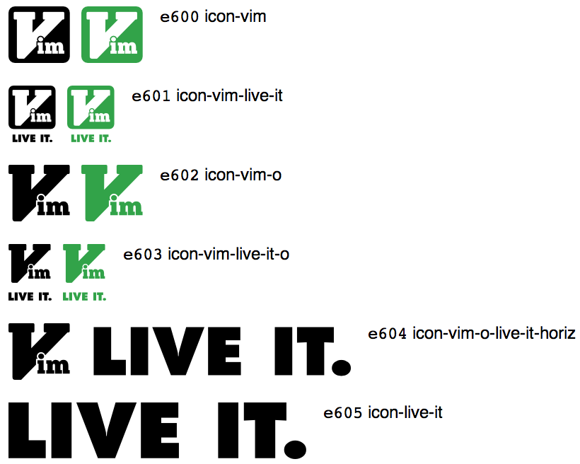

Vim. Live It. Font Glyphs
=========================

It's not enough to use vim, you've got to live it.

This is a font glyph set based on [Tyler Cipriani](http://www.tylercipriani.com)'s [Vim. Live It.](http://www.tylercipriani.com/vim.html) graphic. It was created using the fabulous [IcoMoon App](http://icomoon.io/app)


## Usage

1. Move `fonts/*` into your fonts directory
2. Move [`vli-font.css`](styles/vli-font.css) into your styles directory
3. Adjust the URIs inside `vli-font.css` to match the location of your `fonts` directory.
4. Include `vli-font.css` wherever you want to use the glyphs
5. Assign one of the classes shown below on the `</span>` (or whatever else) that you want the glyph applied to.


## IE

In `index.html`:

```html
<link rel="stylesheet" href="styles/vli-font.css" />

<!-- then, sometime later... -->

<span class="icon-vim"></span>

```


## Glyphs


